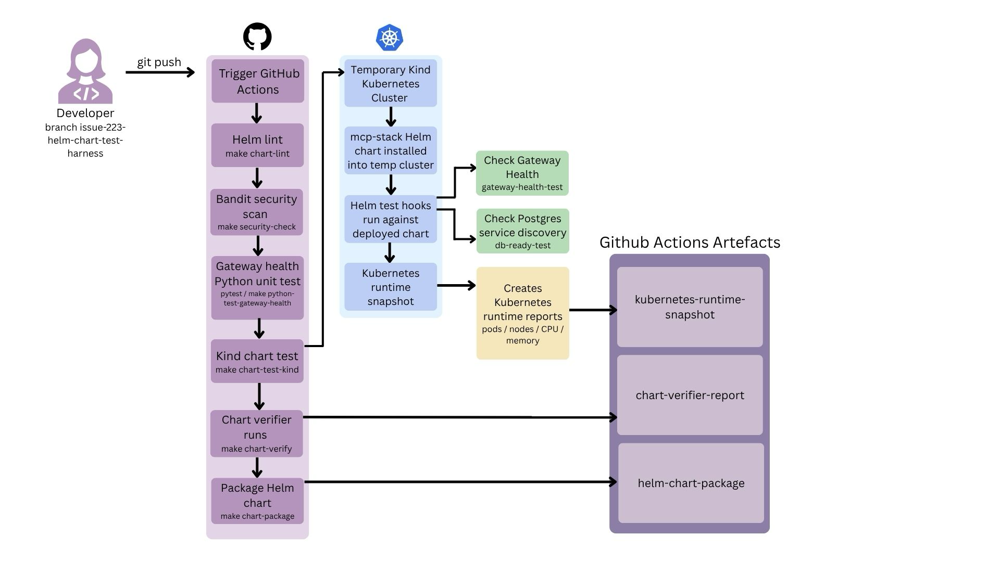

# MCP Gateway Helm Chart Validation CI

## Overview

This project improves the validation workflow for the MCP Gateway Helm chart by adding repeatable local and CI-based checks.

The aim is to make the `mcp-stack` Helm chart easier to test, troubleshoot and review before it is used in a production-like environment. The workflow validates the chart through Helm linting, Python security scanning, Python unit tests, Kind-based Kubernetes deployment testing, Helm test hooks, chart verification, chart packaging and runtime evidence collection.

It focuses on Helm chart validation and release-readiness checks. It is not a full production deployment or full production security assessment of MCP Gateway.

## What this workflow validates

The validation workflow checks that:

* The Helm chart can be linted successfully
* The Python codebase can be scanned for common security issues
* Gateway health-check logic is covered by Python unit tests
* The chart can be deployed into a temporary Kind Kubernetes cluster
* Helm test hooks can validate gateway availability and Postgres service discovery
* Kubernetes runtime evidence can be captured for troubleshooting
* The chart can be verified using chart-verifier
* The chart can be packaged into a Helm chart artefact

## CI and local validation targets

| Target                            | Purpose                                                                                                                          |
| --------------------------------- | -------------------------------------------------------------------------------------------------------------------------------- |
| `make chart-lint`                 | Lints the `mcp-stack` Helm chart for syntax, template, metadata and chart structure issues.                                      |
| `make security-check`             | Runs Bandit against the Python `mcpgateway` codebase to identify common security issues.                                         |
| `make python-test-gateway-health` | Runs pytest unit tests for the gateway health validation helper.                                                                 |
| `make smoke-test-gateway-health`  | Local/manual target that calls a running gateway `/health` endpoint and passes only if it returns HTTP 200 and `status=healthy`. |
| `make chart-test`                 | Runs Helm tests against an already installed `mcp-stack` release.                                                                |
| `make chart-test-kind`            | Creates a temporary Kind cluster, installs the Helm chart, runs Helm tests, captures runtime reports and cleans up.              |
| `make chart-verify`               | Runs chart-verifier and saves the chart verification report.                                                                     |
| `make chart-package`              | Packages the Helm chart into a versioned `.tgz` artefact.                                                                        |

### Notes:
Some targets are used directly in CI, while others are provided for local validation and troubleshooting


## Gateway health validation

The project includes a Python helper:

```text
scripts/ci/check_gateway_health.py
```

This helper validates the expected gateway health contract:

```text
HTTP 200 + {"status": "healthy"} = healthy
anything else = not healthy
```

The unit tests for this helper are located in:

```text
scripts/ci/tests/test_check_gateway_health.py
```

These tests do not deploy the Helm chart. They provide a fast unit-test layer that checks the health-check logic used by the reusable smoke-test helper.

To run the Python unit tests:

```bash
make python-test-gateway-health
```

To run the smoke test against a running local gateway:

```bash
make smoke-test-gateway-health
```

By default, the smoke test checks:

```text
http://127.0.0.1:4444/health
```

This can be overridden:

```bash
make smoke-test-gateway-health GATEWAY_HEALTH_URL=http://your-gateway-url/health
```

## Kind-based chart validation

The Kind-based validation workflow creates a temporary Kubernetes cluster and deploys the `mcp-stack` Helm chart into it.

The Kind test profile uses:

```text
charts/mcp-stack/values-kind-test.yaml
```

This values file is intended only for local and CI validation. It keeps the test environment lightweight by disabling optional demo/admin components and CRD-backed resources that are not required for Helm chart validation.

Run the Kind validation workflow with:

```bash
make chart-test-kind
```

## Helm test hooks

The chart includes Helm test hooks for:

* MCP Gateway availability through the `/health` endpoint
* Postgres service discovery through Kubernetes DNS

These can be run against an installed release with:

```bash
helm test mcp-stack --logs
```

The gateway health test (`gateway-health-test.yaml`) checks that the deployed gateway service is reachable

The database test (`db-ready-test.yaml`) checks that the Postgres service is discoverable inside the Kubernetes cluster

## Runtime evidence

The Kind validation workflow captures Kubernetes runtime evidence under:

```text
reports/
```

Examples include:

* `kubectl-get-pods.txt`
* `kubectl-get-nodes.txt`
* `kubectl-top-pods.txt`
* `kubectl-top-nodes.txt`

These reports help maintainers troubleshoot failed validation runs by checking pod readiness, node status, CPU usage and memory usage.

## CI workflow

The GitHub Actions workflow runs the validation checks automatically when changes are pushed to the project branch.

The workflow includes:

* Helm chart linting
* Python security scanning with Bandit
* Python unit tests for gateway health validation
* Kind-based Helm chart deployment testing
* Helm test hooks
* Runtime report collection
* Chart verification
* Helm chart packaging
* Artefact upload

The workflow produces reviewable artefacts:

* Kubernetes runtime snapshot
* Chart-verifier report
* Packaged Helm chart



The architecture diagram shows the CI workflow from code push to automated checks, Kind deployment testing, runtime evidence collection and uploaded artefacts.

## Supporting documentation

Additional documentation is available under:

```text
docs/helm-chart-validation-ci/
```

Recommended documents:

* `helm-chart-validation-security-assessment.md`
* `ci-quality-gates-and-remediation.md`
* `monitoring-thresholds-and-remediation.md`

These documents explain security considerations, CI quality gates, monitoring thresholds and remediation actions.

## Security notes

The Kind validation environment is temporary and non-production. It should not be used with production data.

The Kind values file contains placeholder test credentials for validation only. Production deployments must override these values using strong secrets managed through Kubernetes Secrets or an approved external secret manager.

Identified security and test-environment risks are documented in `helm-chart-validation-security-assessment.md`

## Troubleshooting

Detailed failure scenarios and remediation steps are documented here:

- `docs/helm-chart-validation-ci/ci-quality-gates-and-remediation.md`
- `docs/helm-chart-validation-ci/monitoring-thresholds-and-remediation.md`

Common starting points:

- If a CI stage fails, check the logs in the GitHub Actions step and rerun the matching Make target locally
- If the Kind chart test fails, check Helm test logs and the Kubernetes runtime snapshot artefact
- If the gateway health check fails, check pod readiness, service name, gateway logs and Helm values

## Project outcome

This project improves the MCP Gateway Helm chart validation workflow by making deployment checks more automated, repeatable and easier to troubleshoot.

It helps contributors and maintainers gain confidence because every pushed code change goes through the same automated validation checks
